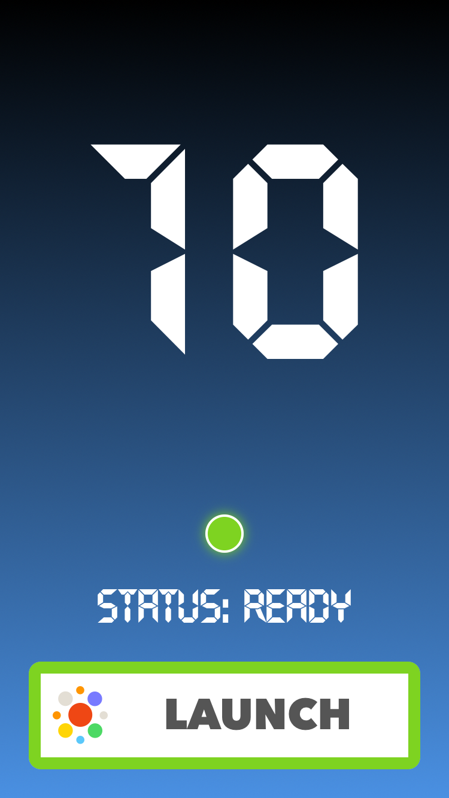
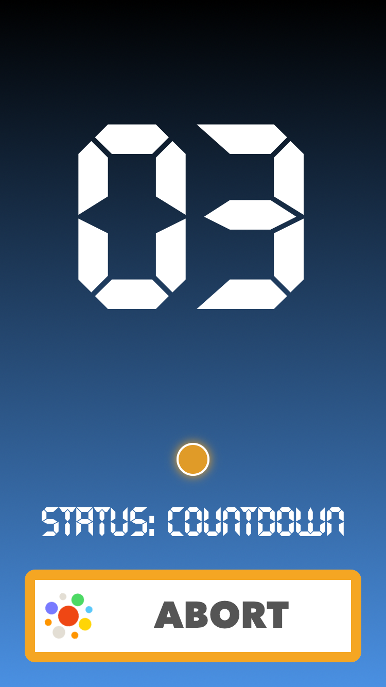

# Mission Control
**Super powerfull remote config utility written in Swift (iOS, watchOS, tvOS, OSX)**

[](https://swift.org)
[](http://www.apple.com)
[](https://github.com/appculture/MissionControl-iOS/blob/master/LICENSE)

[](https://cocoapods.org/pods/MissionControl)
[](https://github.com/Carthage/Carthage)
[](https://github.com/apple/swift-package-manager)

> **Brought to you by**  
> 
> <a href="http://appculture.com"></a>

> Have you ever wished you could change some config parameter for your app without deploying a new version? Of course you have! Wouldn't it be great if you had whole config for your app in the cloud and change it as you see fit? Of course it would! Well, go ahead, just put some config somewhere in the cloud and **MissionControl** will take care of the rest for you.

## Index
- [Features](#features)
- [Usage](#usage)
	- [Initial Configuration](#initial-configuration)
	- [**Phase 1** - No Config](#phase-1---no-config)
	- [**Phase 2** - Local Config](#phase-2---local-config)
	- [**Phase 3** - Remote Config](#phase-3---remote-config)
	- [Force Load Remote Setting](#force-load-remote-setting)
	- [Listen for changes](#listen-for-changes)
- [Demo](#demo)
- [Requirements](#requirements)
- [Installation](#installation)
- [License](#license)

## Features
- Easily take [advantages of using remote (cloud) config](https://library.launchkit.io/every-app-developer-should-move-their-config-to-the-cloud-here-s-why-1efedc8f893f#.3tumo5yfg) for your app
- Simple and flexible API let's you gradually move from no config, via local config to remote config
- Automatic caching of the latest remote settings for offline usage (fail-safe)
- Force load remote setting when you really need the latest config (like NOW)
- Covered with **unit tests**
- Covered with [docs](http://cocoadocs.org/docsets/MissionControl)

## Usage

### Initial Configuration

```swift
/// You should just launch shared instance of MissionControl on your app start.
/// Good place to do this is in your's AppDelegate's didFinishLaunchingWithOptions:

MissionControl.launch()
```

### Phase 1 - No Config

```swift
/// If you're starting from scratch, you could just start using MissionControl right away.
///
/// For anything that you find "configurable" (colors, fonts, alignment, values etc.),
/// instead of just hard-coding it, use helper accessors with setting key and fallback value.
///
/// Here are some examples:

let ready = ConfigBool("Ready", fallback: false)
let numberOfSeconds = ConfigInt("CountdownDuration", fallback: 10)
let launchForce = ConfigDouble("LaunchForce", fallback: 0.5)
let color = ConfigString("ReadyColor", fallback: "#7ED321")
```

### Phase 2 - Local Config

```swift
/// After some time, this adds up and you're probably ready to create some local config.
/// You should just define dictionary with setting keys and values and pass it on launch.
///
/// These settings will override whatever you put before in fallback value of accessors.
/// It doesn't need to contain all the stuff, the rest will just continue to use fallback values.

let config: [String : AnyObject] = [
	"Ready" : true,
	"LaunchForce" : 0.21
]

MissionControl.launch(localConfig: config)
```

### Phase 3 - Remote Config

```swift
/// After some time, you decide to have more influence on these settings,
/// Yes, even if the app is already deployed. We get it!
///
/// But, you should create that backend part yourself (sorry).
/// Just make sure that you return JSON formatted key-value dictionary in response body.
/// Then, all you need to do is pass your's backend URL on launch.
///
/// After the first refresh (done automatically on launch) remote settings will be cached to disk.
/// These remote settings will override whatever you put in local config dictionary.
///
/// All helper accessors will respect these priority levels:
/// 1. Remote setting from memory (received in the most recent refresh).
/// 2. Remote setting from disk cache (if never refreshed in current app session (ex. offline)).
/// 3. Local setting from disk (defaults provided in `localConfig` on `launch`).
/// 4. Inline provided fallback value

let remoteURL = NSURL(string: "http://appculture.com/mission-control")!
MissionControl.launch(localConfig: config, remoteConfigURL: remoteURL)
```

### Force Load Remote Setting

```swift
/// If you need, you can always call `refresh` manually to get the latest settings.
/// Good place to call this is in your AppDelegate's applicationWillEnterForeground: or applicationDidBecomeActive:

MissionControl.refresh()

/// There are also "async force remote" helper accessors which you can use
/// when it's really important to have the latest setting or abort everything.

ConfigBoolForce("Abort", fallback: true) { (forced) in
    if forced {
        self.stopCountdown()
        self.state = .Aborted
    }
}
```

### Listen for changes

```swift
/// MissionControl can inform you whenever remote config is refreshed or failed to do so.
/// You can observe for these notifications, or become a MissionControl's delegate, whatever you prefer.

// MARK: - Notifications

let center = NSNotificationCenter.defaultCenter()
center.addObserver(self, selector: #selector(handleRefresh(_:)),
                   name: MissionControl.Notification.DidRefreshConfig, object: nil)
center.addObserver(self, selector: #selector(handleFail(_:)),
                   name: MissionControl.Notification.DidFailRefreshingConfig, object: nil)

// MARK: - MissionControlDelegate

MissionControl.delegate = self
    
func missionControlDidRefreshConfig(old old: [String : AnyObject]?, new: [String : AnyObject]) {
	/// do whatever you need to do
}
    
func missionControlDidFailRefreshingConfig(error error: ErrorType) {
	/// ignore or not, it's up to you
}
```

## Demo

Be sure to check out our example demo project from this repo.  
It's kind of a "**Rocket Launcher**" which doesn't really launch rockets,
but it demonstrates power of using **MissionControl**. 

<a href="Images/MissionControl-01-Offline.png"></a>
<a href="Images/MissionControl-02-Ready.png"></a>
<a href="Images/MissionControl-03-Countdown.png"></a>

Let me explain:

1. First screen is initial "**Offline**" state in which you need to "**Connect**" to the base (remote config).
2. When you press "**Connect**" button it will **force load** remote config asking for the "**Ready**" Bool flag.
3. If remote config returns that **"Ready" = true** it will go to the **Launch** screen, otherwise **Failure** screen.
4. From the **Launch** screen you can initiate the **Countdown**. Number of seconds is also provided via remote config.
5. During the **Countdown**, on each second, app checks if launch should be aborted by force loading **"Abort"** Bool flag from remote. Yes, you can **abort the launch remotely** from MissionControl.
6. After Countdown is finished, you can see some nice animation and **that's all folks**.

**P.S.** Some colors and other values were also provided via remote config.  
Here's what settings are used in this demo, so you can try to abort launch from your server.  
Just remember to pass your URL to **MissionControl** `launch:` method.

```json
{
    "TopColor": "#000000",
    "BottomColor": "#4A90E2",
    "Ready": true,
    "CountdownDuration": 10,
    "Abort": false,
    "LaunchForce": 0.5,
    "OfflineColor": "#F8E71C",
    "ReadyColor": "#7ED321",
    "CountdownColor": "#F5A623",
    "LaunchedColor": "#BD10E0",
    "FailedColor": "#D0021B",
    "AbortedColor": "#D0021B"
}
```

### So, are you ready for the "Real Time" apps?! [We are](http://appculture.com).

## Requirements
- Xcode 7.3+
- iOS 8.0+

## Installation

- Using [CocoaPods](http://cocoapods.org/):

    ```ruby
    pod 'MissionControl'
    ```

- [Carthage](https://github.com/Carthage/Carthage):

    ```ogdl
    github "appculture/MissionControl-iOS"
    ```

- Manually:

  Just drag **MissionControl.swift** into your project and start using it.

## License
MissionControl is released under the MIT license. See [LICENSE](LICENSE) for details.
